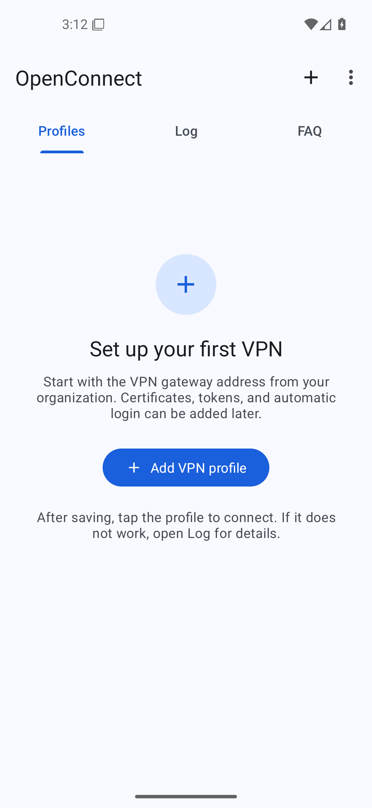
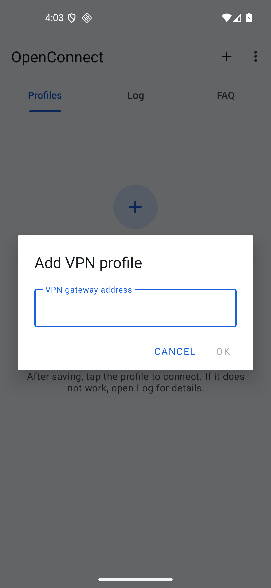
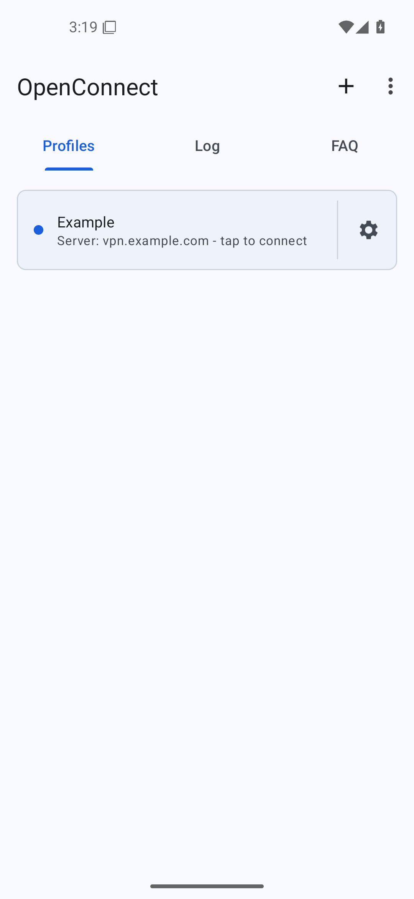
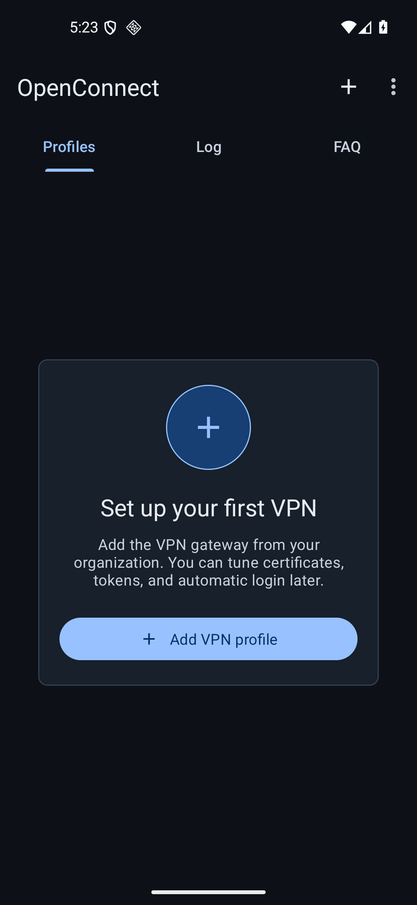
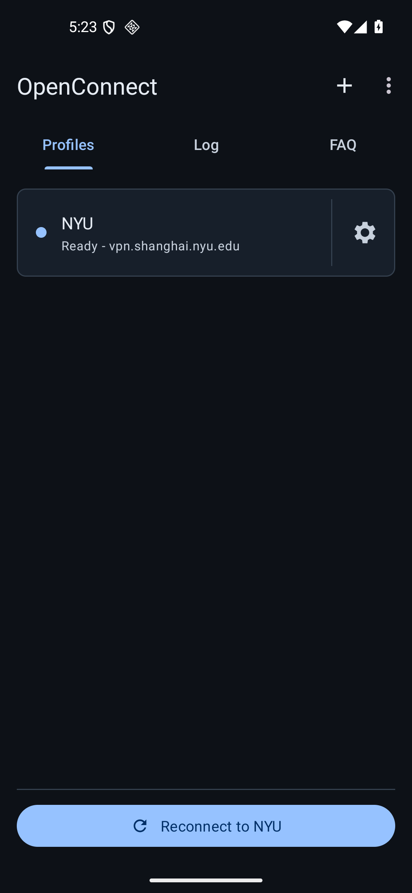
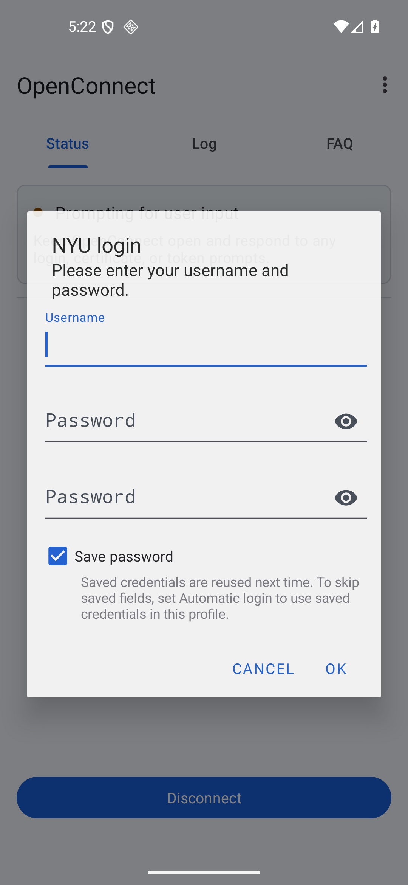
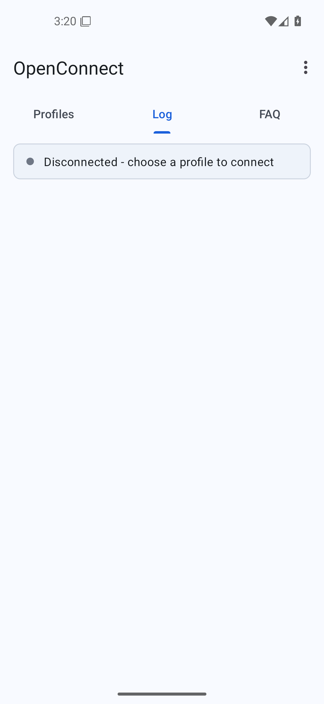
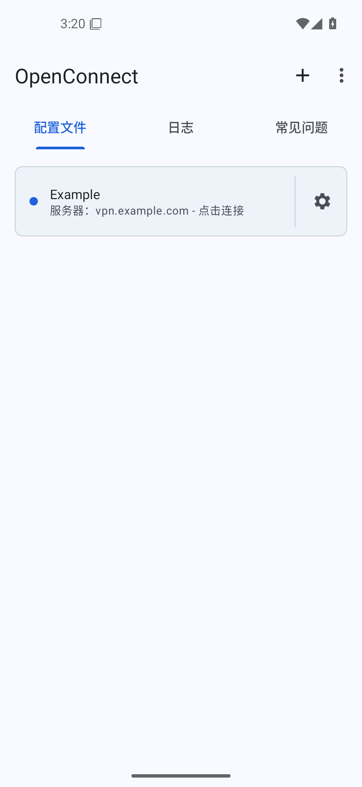

# OpenConnect for Android

OpenConnect for Android is a VPN client for Android based on the Linux
[OpenConnect](https://www.infradead.org/openconnect/) client.

This fork modernizes the Android build and refreshes the app UI with Material 3.
It keeps the core VPN workflow fast: add a gateway, save the profile, then tap
the profile to connect.

## Download

This project is currently distributed only through
[GitHub Releases](https://github.com/pengyue-polaron/openconnect-next-android/releases/latest).

Download the APK from the latest release and install it on your Android device.
The app is not currently published through any app marketplace.

## Highlights

- Material 3 app shell, tabs, dialogs, settings, and list rows.
- Clear first-run setup for adding the first VPN gateway.
- One-tap profile connection with a separate settings shortcut.
- Log and connection status panels that explain disconnected, connecting, and
  connected states.
- Automatic login, formerly shown as Batch mode, described as the saved
  credentials / passwordless login flow.
- English, Simplified Chinese, and Traditional Chinese copy for the updated
  onboarding and Batch mode settings.

## Screenshots

<p>
  
  
  
</p>

<p>
  
  
  
</p>

<p>
  
  
</p>

## Basic Use

1. Open the app and choose **Add VPN profile**.
2. Enter the VPN gateway address from your organization.
3. Save the profile.
4. Tap the profile row to connect.
5. Use the gear button to edit advanced settings such as certificates, tokens,
   saved credentials, and automatic login.
6. If a connection fails, open the **Log** tab for the reason.

## Automatic Login

**Automatic login** is the passwordless flow formerly exposed as Batch mode. It
uses credentials saved from a normal login prompt.

- **Ask every time**: always show the VPN server login prompt.
- **Use saved credentials when available**: reuse saved fields and only ask for
  missing or changed prompts.
- **Use saved credentials only**: never show login prompts. If required data is
  missing, the connection stops so the profile can be updated.

## Build From Source

### Requirements

- Android SDK with platform tools installed.
- JDK 17 or newer.
- Git submodules initialized.

### Build

```bash
git clone https://github.com/pengyue-polaron/openconnect-next-android.git
cd openconnect-next-android
git submodule update --init --recursive
./gradlew assembleDebug
```

The debug APK is written to:

```text
app/build/outputs/apk/debug/app-debug.apk
```

Install it on a connected device or emulator:

```bash
adb install -r app/build/outputs/apk/debug/app-debug.apk
```

## License

OpenConnect for Android is released under the GPLv2 license. See
[COPYING](COPYING) and [doc/LICENSE.txt](doc/LICENSE.txt) for details.

Much of the Java code was derived from OpenVPN for Android by Arne Schwabe.
