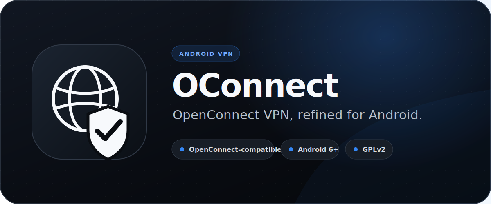
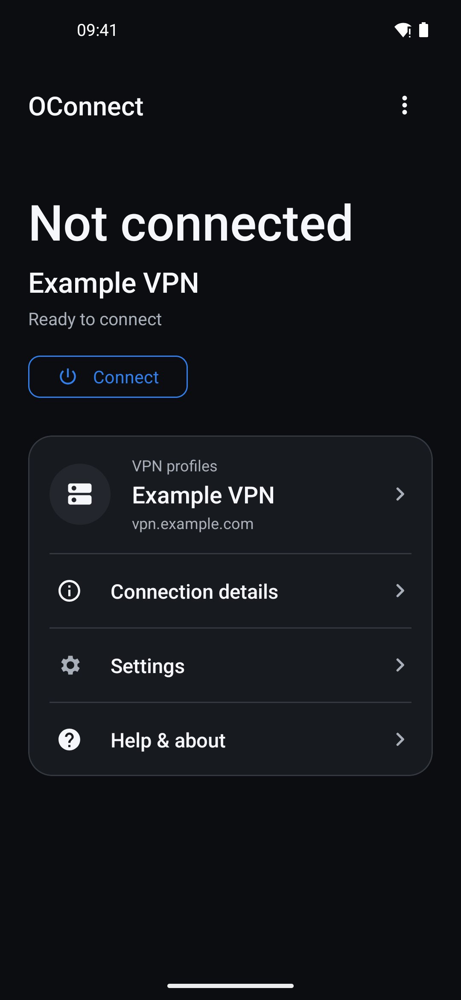
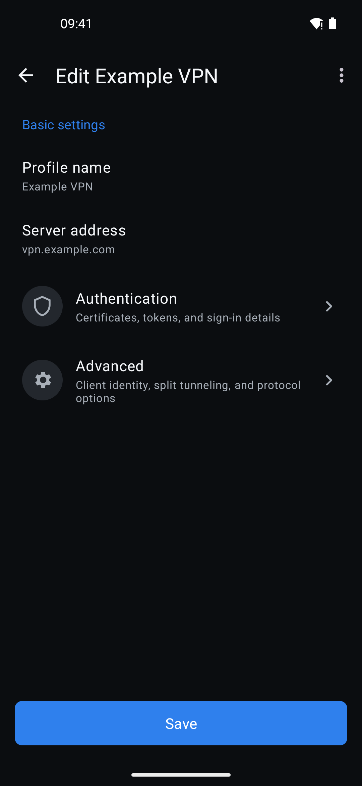
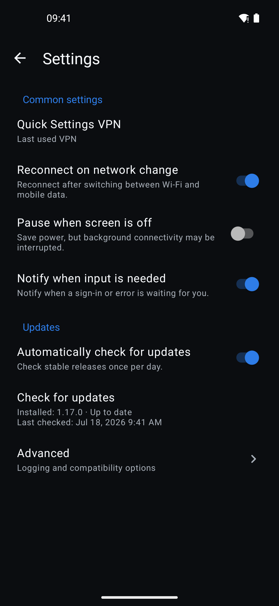
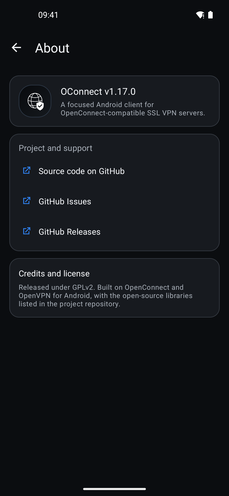

# OConnect

<p align="center">
  
</p>

<p align="center">
  <a href="https://github.com/pengyue-polaron/openconnect-next-android/releases/latest"></a>
  <a href="app/build.gradle"></a>
  <a href="COPYING"></a>
</p>

<p align="center">
  <strong>A focused, open-source Android client for OpenConnect-compatible SSL VPN gateways.</strong><br>
  Clear profiles, modern Android controls, and the full OpenConnect connection engine—without root.
</p>

<p align="center">
  <a href="https://github.com/pengyue-polaron/openconnect-next-android/releases/latest"><strong>Download the latest APK</strong></a>
  · <a href="docs/README.md">Documentation</a>
  · <a href="https://github.com/pengyue-polaron/openconnect-next-android/issues">Report an issue</a>
</p>

## Why OConnect

| Focused | Compatible | Android-native |
| --- | --- | --- |
| A clear dashboard, guided profile setup, and settings organized around real connection tasks. | Works with OpenConnect-compatible gateways, including Cisco AnyConnect-compatible servers and ocserv. | Material light and dark themes, Quick Settings integration, notifications, update checks, and modern Android behavior. |

OConnect keeps the proven OpenConnect VPN core while modernizing the Android
experience around it. It is maintained as a distinct app with its own identity,
application ID, release channel, and product documentation.

## Interface

These screenshots were captured from OConnect v1.17.0 on Android 16 using only
fictional example data.

| Dashboard | Profile setup |
| :---: | :---: |
|  |  |

| Settings | About OConnect |
| :---: | :---: |
|  |  |

Additional current screenshots, including onboarding and Simplified Chinese,
are available in [`screenshots/readme`](screenshots/readme/).

## Capabilities

- OpenConnect-compatible SSL VPN connections without root.
- Profiles for organization, school, and self-hosted VPN gateways.
- Saved credentials and automatic login for repeat connections.
- RSA SecurID and TOTP software token support.
- Certificate, private-key, client-identity, CSD, PFS, XML POST, DPD, and
  split-tunneling options.
- Connection status, byte counters, local IP details, logs, and reconnect
  handling.
- Quick Settings tile with a default profile, last-used behavior, or an app
  selection fallback.
- Material interface with light and dark themes.
- Refreshed English, Simplified Chinese, and Traditional Chinese product copy.

## Install

OConnect is currently distributed through
[GitHub Releases](https://github.com/pengyue-polaron/openconnect-next-android/releases/latest).
Download the latest APK and open it on a device running Android 6.0 or newer.

> [!IMPORTANT]
> OConnect uses the application ID `io.pengyue.oconnect`. It installs as a
> separate app and does not automatically migrate profiles or settings from
> OpenConnect Next (`io.pengyue.openconnectnext`) or other OpenConnect apps.

GitHub APK installations do not receive updates through an app store. OConnect
can check GitHub for new stable releases, but installation still requires user
confirmation.

## Quick Start

1. Open OConnect and choose **Add VPN profile**.
2. Enter the VPN gateway supplied by your organization.
3. Review the generated profile name and configure certificates, tokens, or
   advanced options when required.
4. Save the profile, choose **Connect**, and complete the prompts sent by the
   VPN server.
5. Open **Connection details** or the **Log** view when troubleshooting.

<details>
<summary><strong>Automatic login behavior</strong></summary>

Automatic login reuses credentials saved from a normal login prompt.

- **Ask every time** always shows the VPN server login prompt.
- **Use saved credentials when available** reuses known fields and asks only
  for missing or changed prompts.
- **Use saved credentials only** never opens a login prompt. The connection
  stops if required data is missing so the profile can be updated.

</details>

## Build From Source

### Requirements

- JDK 17 or newer.
- Android SDK and platform tools.
- Android NDK r27c (`ndk;27.2.12479018`).
- GNU Make, Autoconf, Automake, Libtool, and pkg-config.
- Git submodules initialized.

```bash
git clone https://github.com/pengyue-polaron/openconnect-next-android.git
cd openconnect-next-android
git submodule update --init --recursive
make -C external install
./gradlew testDebugUnitTest lintDebug assembleDebug
```

The native build pins OpenConnect v9.21, stoken v0.93, curl 8.21.0, and the
cryptographic dependencies declared by OpenConnect's Android build. Native
executables and shared libraries support 16 KB Android page sizes.

Override the NDK location when needed:

```bash
make -C external install ANDROID_NDK="$ANDROID_HOME/ndk/27.2.12479018"
```

The debug APK is written to `app/build/outputs/apk/debug/app-debug.apk` and can
be installed on a connected device with:

```bash
adb install -r app/build/outputs/apk/debug/app-debug.apk
```

## Distribution and Project Status

- **Current channel:** GitHub Releases.
- **Google Play:** not published.
- **F-Droid:** preparation in progress; see
  [the packaging notes](docs/fdroid.md).
- **Application ID:** `io.pengyue.oconnect`.
- **Minimum Android version:** Android 6.0 / API 23.

Brand guidance, packaging notes, and release documentation are indexed in
[`docs/README.md`](docs/README.md).

## Contributing

Issues and pull requests are welcome. Useful contributions include Android and
VPN-server compatibility fixes, accessibility polish, translations, F-Droid
packaging, and reproducible release signing.

When reporting a connection issue, include the Android version, device model,
gateway type if known, and relevant Log output. Never include passwords,
private keys, tokens, cookies, or organization secrets.

## Security

OConnect can route device traffic through a configured VPN gateway. Only
install APKs from a source you trust and only connect to gateways you control
or are authorized to use. Report security-sensitive issues privately to the
repository owner before opening a public issue.

## Lineage and License

OConnect is released under the GPLv2 license. See [COPYING](COPYING) and
[doc/LICENSE.txt](doc/LICENSE.txt).

This project is a maintained fork of the original OpenConnect for Android
codebase. Much of the Java code was derived from OpenVPN for Android by Arne
Schwabe. The app also includes OpenConnect, GnuTLS, GMP, Nettle, Libxml2, OATH
Toolkit, stoken, LibTomCrypt, and cURL components.
