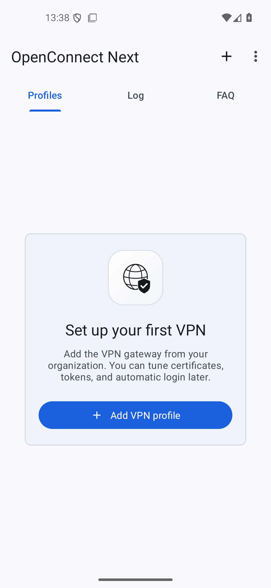
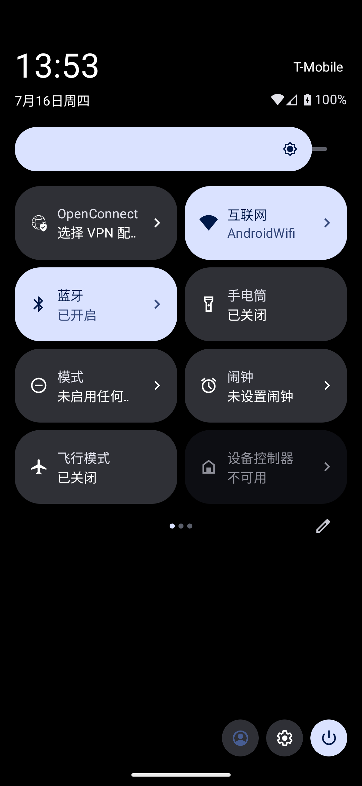

# OpenConnect Next

[](COPYING)
[](app/build.gradle)
[](https://github.com/pengyue-polaron/openconnect-next-android/releases/latest)

OpenConnect Next is a modern Android client for
[OpenConnect](https://www.infradead.org/openconnect/)-compatible SSL VPN
gateways, including Cisco AnyConnect-compatible servers and ocserv.

This repository is a maintained fork of the original OpenConnect for Android
codebase. It keeps the existing VPN core while updating the Android build,
the Material interface, onboarding, saved-credential login, localization, and
project documentation.

## Status

- Distribution: GitHub Releases only for now.
- Stores: not published on Google Play, F-Droid, or other app stores yet.
- F-Droid: planned; see [docs/fdroid.md](docs/fdroid.md).
- App name: **OpenConnect Next**.
- Android application ID: `io.pengyue.openconnectnext`.

## Features

- OpenConnect-compatible SSL VPN connections without root.
- Profile-based setup for organization, school, and self-hosted VPN gateways.
- Saved credentials and automatic login for repeat connections.
- RSA SecurID and TOTP software token support.
- Connection log, status view, byte counters, local IP details, and reconnect
  handling.
- Android Quick Settings tile for reconnecting the last profile or disconnecting
  the active VPN.
- Material 3 UI with light and dark mode.
- English, Simplified Chinese, and Traditional Chinese copy for the refreshed
  onboarding, settings, FAQ, and connection flows.

## Screenshots

<p>
  
  
  
</p>

<p>
  
  
  
</p>

<p>
  
</p>

## Install

Download the latest APK from
[GitHub Releases](https://github.com/pengyue-polaron/openconnect-next-android/releases/latest)
and install it on your Android device.

Current release APKs are published directly from this repository while store
distribution is being prepared. If you install an APK manually, Android will
not receive updates from an app store automatically.

## Basic Use

1. Open the app.
2. Choose **Add VPN profile**.
3. Enter the VPN gateway address from your organization.
4. Tap the profile row to connect.
5. Complete the login, certificate, group, or token prompts sent by the VPN
   server.
6. Open the **Log** tab if a connection fails.

Advanced profile settings include CA certificates, user certificates, private
keys, software tokens, split tunneling, reported OS, DPD timeout, and automatic
login behavior.

## Automatic Login

Automatic login is the passwordless flow previously exposed as **Batch mode**.
It reuses credentials saved from a normal login prompt.

- **Ask every time**: always show the VPN server login prompt.
- **Use saved credentials when available**: reuse saved fields and ask only for
  missing or changed prompts.
- **Use saved credentials only**: never show login prompts. If required data is
  missing, the connection stops so the profile can be updated.

## Build From Source

### Requirements

- JDK 17 or newer.
- Android SDK with platform tools.
- Git submodules initialized.

### Build

```bash
git clone https://github.com/pengyue-polaron/openconnect-next-android.git
cd openconnect-next-android
git submodule update --init --recursive
./gradlew assembleDebug
```

The debug APK is written to:

```text
app/build/outputs/apk/debug/app-debug.apk
```

Install it on a connected device or emulator:

```bash
adb install -r app/build/outputs/apk/debug/app-debug.apk
```

Run the current verification command:

```bash
./gradlew assembleDebug testDebugUnitTest
```

## F-Droid

F-Droid inclusion is not automatic. The app needs source metadata, a buildable
tagged release, and a merge request to the `fdroiddata` repository. The current
preparation notes and checklist live in [docs/fdroid.md](docs/fdroid.md).

The Android application ID has been migrated to `io.pengyue.openconnectnext`
so this fork can be submitted separately from existing OpenConnect packages in
the F-Droid ecosystem.

## Contributing

Issues and pull requests are welcome. Useful contributions include:

- Android compatibility fixes.
- VPN server compatibility reports.
- UI and accessibility polish.
- Translation improvements.
- F-Droid packaging work.
- Reproducible build and release signing improvements.

When reporting a connection issue, include the Android version, device model,
VPN gateway type if known, and relevant Log tab output. Do not include
passwords, private keys, tokens, or organization secrets.

## Security

This is VPN software and can route device traffic through a configured server.
Only install APKs from a source you trust, and only connect to VPN gateways you
control or are authorized to use.

Please report security-sensitive issues privately to the repository owner before
opening a public issue.

## License

OpenConnect Next is released under the GPLv2 license. See [COPYING](COPYING)
and [doc/LICENSE.txt](doc/LICENSE.txt).

Much of the Java code was derived from OpenVPN for Android by Arne Schwabe.
This package also includes OpenConnect, GnuTLS, GMP, Nettle, Libxml2, OATH
Toolkit, stoken, LibTomCrypt, and cURL components.
